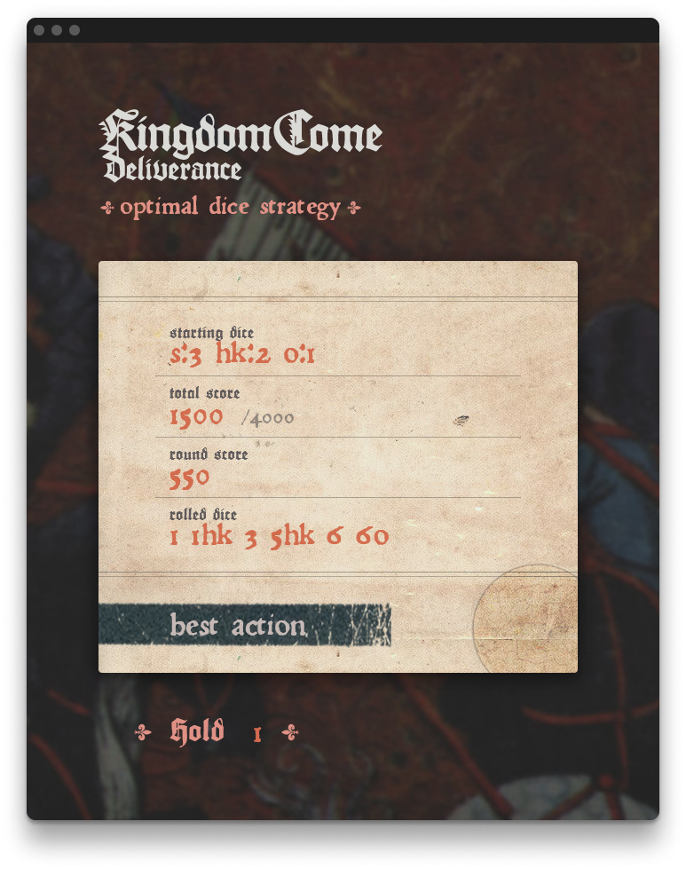

# Kingdom Come: Deliverance - Optimal Dice Strategy

site: <https://phlip9.com/kcddice>



I started playing KC: D a few months ago and got a bit hooked playing the dice game. In a rather classic software engineer move, I thought "I bet I can write an algorithm to play this..." Well, here we are after probably more hours than I've dumped into KC: D itself. I present: [Kingdom Come: Deliverance - Optimal Dice Strategy](https://phlip9.com/kcddice/)! Now my Henry is a gambling god, and yours can be too! : )

## How do you use it?

There are just four inputs you gotta fill out.

1. **starting dice**: these are *your* dice. Note the dice names are written in "short-code"; you can see which short-codes correspond with which dice on the right. For example, if you're just starting out with 6 "standard" dice you would write `s:6`. If you had 3 "standard" dice, 2 Heavenly Kingdom dice, and 1 Odd die, then you would write `s:3 hk:2 o:1`.
2. **total score**: this is your current total score, out of 4000 (by default). These points are the one's you've earned from past rounds, which won't get taken away if you bust this turn.
3. **round score**: these are the points you've earned _this round_. If you bust and don't roll any scoring dice this turn, you'll _lose_ these points.
4. **rolled dice**: these are the dice you've just rolled onto the board. For example, If you've rolled four standard dice, and they come up with two ones, a four, and a six, you would write `1 1 4 6` (the order doesn't matter). If you've rolled two standard dice, two Heavenly Kingdom dice, and an Odd die, and they come up 1, 3, 6 for the standards; 1, 5 for the Heavenly Kingdoms; and 6 for the Odd; you would write `1 1hk 3 5hk 6 6o` (again, order doesn't matter).

Then hit **best action** and the algorithm will tell you to pass (select the highest scoring dice) or hold some dice and roll again.

Pro tip: open up the developer console to see some extra stats!

## Cool stats

* With 6 standard dice, you can bust on the first roll with ~3% probability.
* With 6 standard dice, you can expect to reach 4000 points in ~7.5 turns, scoring ~530 points each turn.
* When both players use 6 standard dice, the player who goes first is ~7% more likely to win (if they both use this strategy).

## How does it work?

The algorithm is a single-player [expectimax search](https://phlip9.com/notes/AI%20ML/Expectimax%20Search/), with lots of clever bit-packing, SIMD, caching, and interning to make it faster. You can see the search algorithm here: <https://github.com/phlip9/kcddice/blob/master/kcddice/src/search.rs> and the core data structures here: <https://github.com/phlip9/kcddice/blob/master/kcddice/src/dice.rs>.

## Caveats

I didn't bother supporting Jokers/devils, since my Henry hasn't found any dice with them : )

Unfortunately, the current algorithm is actually not _quite_ optimal, since it doesn't consider the opponent's score or dice. You can see it's suggestions are not risky enough when your opponent is far ahead. If your opponent has only one roll left to (almost always) win, you should just go for broke and try to win on this turn; however, this algorithm doesn't currently take these factors into account.

I have some plans to change the setup from expectimax to a [markov decision process (MDP)](https://phlip9.com/notes/AI%20ML/Markov%20Decision%20Process%20(MDP)/) solved with [Q-value Iteration](https://phlip9.com/notes/AI%20ML/Markov%20Decision%20Process%20(MDP)/#q-value-iteration), but haven't had the time recently.

## Bonus: `kcddice` CLI

There's a CLI which supports a few other interesting searches, like computing the complete turn score PMF (rather than just the expected value) or computing the full turns-to-win CDF.

If you've cloned the repo and have the Rust toolchain setup (see <https://rustup.rs/> for instructions), try running:

```bash
$ cargo run --release -p kcddice -- --help

kcddice - A utility for optimally playing the Kingdom Come: Deliverance dice game!

USAGE:
    kcddice [option ...] <subcommand>

SUBCOMMANDS:
    · kcddice list-dice - list all the supported dice and their short names
    · kcddice best-action - compute the best action to take in a round
    · kcddice score-distr - compute full score PMF given the score and dice left to roll
    · kcddice markov-matrix - compute score PMF for each round score
    · kcddice turns-cdf - compute the turns-to-win distribution and win probability
```

To compute the best action in a given turn

```bash
$ cargo run --release -p kcddice -- best-action -s [s:3,hk:2,o:1] -m 4000 -t 0 0 [1,1hk,1hk,5,5,5o]

      action  held dice                 exp v pbust
   hold dice  [1, 1hk, 1hk, 5, 5, 5o]  2120.6  0.01
        pass                           1500.0  0.00
   hold dice  [1, 1hk, 1hk, 5, 5]       970.2  0.47
   hold dice  [1, 1hk, 1hk]             953.4  0.19
   hold dice  [1, 1hk, 1hk, 5]          902.5  0.31
   hold dice  [1, 1hk, 1hk, 5o]         704.7  0.44
   hold dice  [1, 1hk, 5, 5, 5o]        692.8  0.53
   hold dice  [1]                       687.7  0.03
   hold dice  [1, 5, 5, 5o]             671.3  0.28
   hold dice  [5]                       660.3  0.03
         ...  (+ 26)

            search duration  415.67ms
           actions explored  5793280
         game finished rate  0.054
    action value cache size  1726 (27.7 KB)
action value cache hit rate  0.933 (h: 4357884, m: 312680)
         actions cache size  16463 (1.9 MB)
     actions cache hit rate  0.987 (h: 1207829, m: 16463)
```

Calculate the turns-to-win CDF, where we have different dice than our opponents. (Note: assumes both players use this strategy).

```bash
$ cargo run --release -p kcddice -- turns-cdf -o [s:3,hk:2,o:1] -t [s:4,o:2]

    turn  our turns CDF         their turns CDF
       1  0.007138207154443762  0.0029301676565370886
       2  0.03332778795741593   0.014731071671726641
       3  0.12456742043397327   0.06250080899838494
       4  0.29767752243325224   0.17568773716955927
       5  0.5061548379713456    0.34933047836664
       6  0.6904785674972526    0.5413833279911561
       7  0.8231398817571483    0.7083466659063571
       8  0.9060545389848405    0.8300888925623058
       9  0.9529036181655857    0.9079849145579796
      10  0.9774622466646818    0.9531028985619174
      11  0.98961570094512      0.9772790577437783
      12  0.9953630256891944    0.9894519987718127
      13  0.9979830890702442    0.9952777276447194
      14  0.9991420459672683    0.9979507272901328
      15  0.9996419485088873    0.9991343815254925
      16  0.999853024680646     0.9996428798786392
      17  0.9999405337287628    0.9998556921617996
      18  0.9999762438312589    0.9999427497249962
      19  0.999990615969984     0.999977657075026
      20  0.9999963302304651    0.9999914076897779

search_duration  50.13s
        Pr[win]  0.6731993144019213
```
